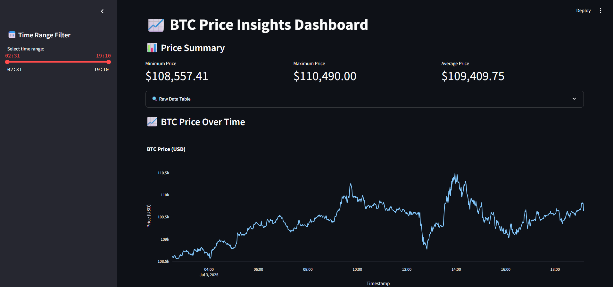
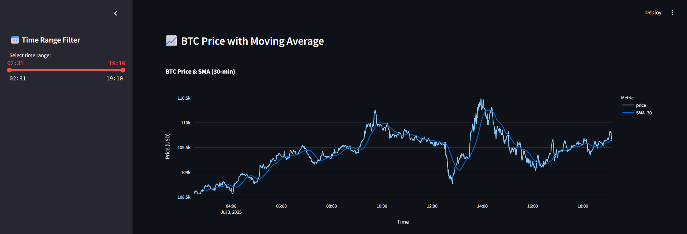
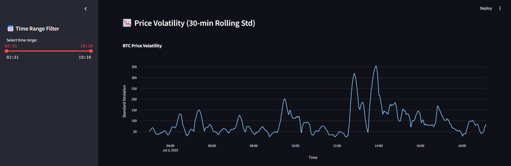
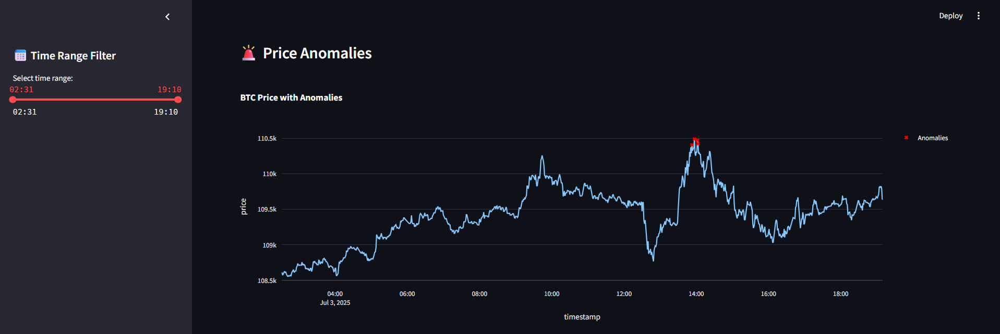
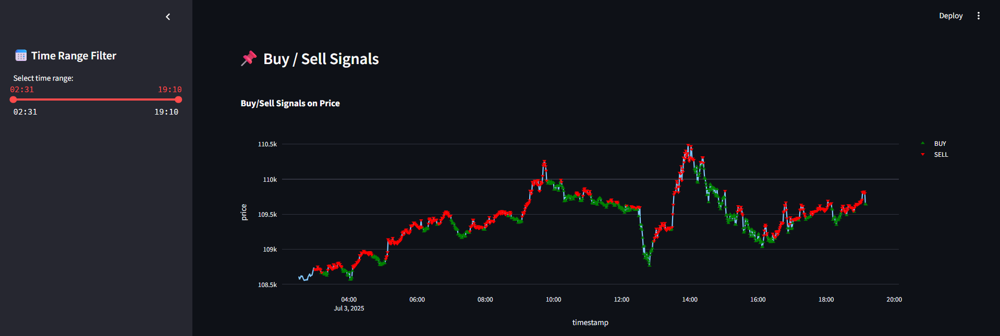
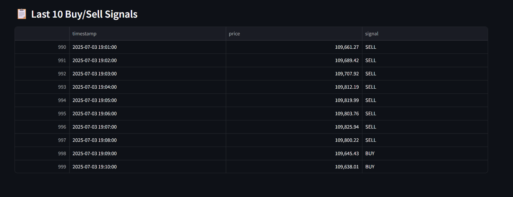

# 📈 Algorithmic Trade Insights – BTC Price Analytics Dashboard

**Simulating a real-world data science workflow for an algorithmic trading environment.**  
This project was developed as part of a self-initiated case study inspired by the job description at BlockTech. It demonstrates my end-to-end capabilities in collecting real-time financial data, analyzing it using statistical and technical indicators, and building an interactive visualization platform for traders and analysts.

---

## 🎯 Project Objective

To build a complete data science pipeline that:

- Retrieves high-frequency Bitcoin price data
- Performs time-series analysis and anomaly detection
- Generates trading signals using SMA crossover
- Visualizes everything in an interactive dashboard for actionable insights

---


---

## 🔧 Technologies Used

| Purpose               | Tools / Libraries                  |
|------------------------|-----------------------------------|
| Data Collection        | `requests`, `Binance API`         |
| Data Manipulation      | `pandas`, `numpy`                 |
| Statistical Analysis   | `scipy` (Z-score)                 |
| Technical Indicators   | `rolling mean`, `std deviation`   |
| Visualization          | `plotly.express`, `streamlit`     |

---

## 🚀 Features

- ✅ Real-time price data fetching from Binance (1-min interval)
- ✅ Data saved as CSV for reproducibility
- ✅ SMA (Simple Moving Average) and Volatility analysis
- ✅ Z-score based anomaly detection
- ✅ Buy/Sell signal generation using SMA crossover logic
- ✅ Fully interactive dashboard with sliders and filters

---

## 📊 Dashboard Preview
 













---

## 🔍 Step-by-Step Breakdown

### ✅ Step 1 – Project Setup
- Created the folder structure: `src/`, `data/`, `dashboard/`
- Installed required libraries via `pip`

---

### ✅ Step 2 – Data Collection
- Connected to the [Binance API](https://api.binance.com)
- Pulled 1-day worth of BTC/USDT price data at 1-minute intervals
- Parsed and saved as `data/btc_price_data.csv`

---

### ✅ Step 3 – Data Fetcher Script
- Wrote `data_fetcher.py` to handle the API call
- Converted Unix timestamps into `datetime`
- Exported clean CSV ready for analysis

---

### ✅ Step 4 – Streamlit App Setup
- Created `app.py` inside the `dashboard/` folder
- Loaded and displayed the raw data
- Visualized basic price trend using `plotly.express`

---

### ✅ Step 5 – Interactive Controls
- Added a sidebar time-range slider
- Enabled users to filter the graph dynamically
- Refreshed table and visuals based on selected time

---

### ✅ Step 6 – Technical Indicators
- Calculated 30-point Simple Moving Average (SMA)
- Calculated Rolling Volatility using standard deviation
- Visualized both on time-series graphs

---

### ✅ Step 7 – Anomaly Detection
- Applied Z-Score on price data
- Marked anomalies when z > 2.5 or z < -2.5
- Visualized anomalies on the price chart

---

### ✅ Step 8 – Signal Generation
- Created a simple SMA crossover strategy:
    - Price > SMA → **SELL**
    - Price < SMA → **BUY**
- Highlighted buy/sell signals on the graph
- Added a table to show last 10 signals

---


## 📁 How to Run

1. Clone the repository:

```bash
git clone https://github.com/berkaykorcum/algorithmic-trade-insights.git
cd algorithmic-trade-insights
```

2. Install the dependencies:
```bash
pip install -r requirements.txt
```

3. Fetch fresh BTC price data:
```bash
python main.py

```

4. Launch the dashboard in your browser:
```bash
streamlit run dashboard/app.py

```

## 📐 Technical & Statistical Concepts

---

### 📊 Simple Moving Average (SMA)

SMA is used to smooth out price data by averaging a number of past prices.

**Formula:**  
SMA_t = (P_t + P_{t-1} + ... + P_{t-n+1}) / n  
Where:  
- P_t: Price at time t  
- n: Number of periods (e.g., 30 minutes)

---

### 📈 Rolling Volatility (Standard Deviation)

Volatility measures the variation of prices over time.

**Formula:**  
σ = sqrt( (Σ(P_i - μ)²) / n )  
Where:  
- μ: Mean of the prices  
- σ: Standard deviation (volatility)

---

### 🚨 Z-Score Based Anomaly Detection

Z-score indicates how many standard deviations a value is from the mean.

**Formula:**  
z = (P_t - μ) / σ  
If |z| > 2.5 → the price is considered an anomaly.

---

### 📉 SMA Crossover Trading Strategy

Basic logic used:

- If Price < SMA → **BUY signal**  
- If Price > SMA → **SELL signal**


